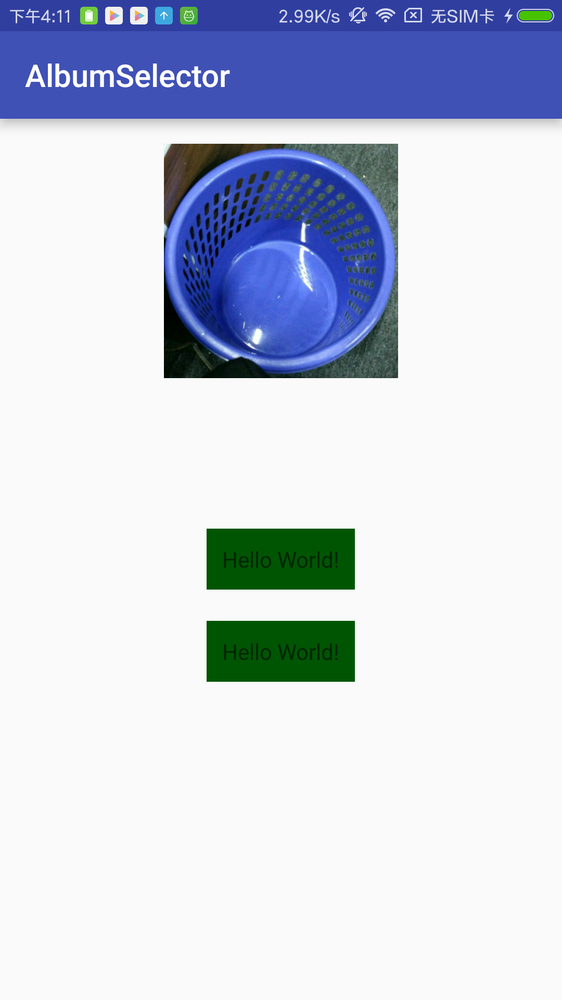
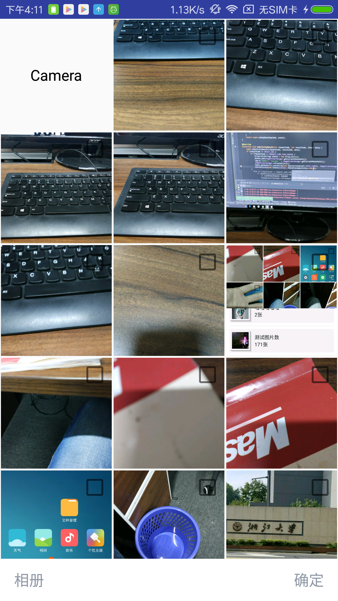
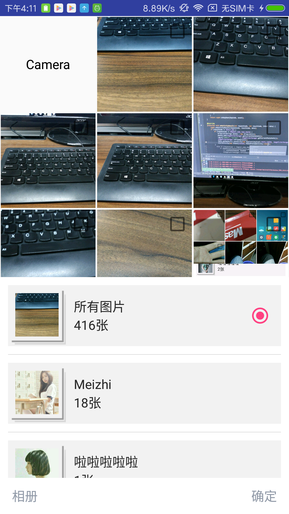

# RxMvpAlbum

###### RxJava 实现相册选择

##第一版主要功能：
######图片展示：使用王浩的BGA文件读取方式，以线程方式后台一次读取所有的图片

######相册单选：项目单选方式个人觉得比较好，避免了大规模的notification。

######拍照：拍照可自己设定，通过一个布尔值判断。拍照成功自动跳转到裁剪界面。

######图片裁剪：裁剪目前只可裁剪成正方形，暂时还未优化。

###### Rxbus:项目中使用收集的RxBus，简单需求基本可以满足。

##第二版主要功能：
######相册多选

##预览：

<image src="./AlbumSelector/screenshot/Albumselector_start.png" width="250px"/>
<image src="./AlbumSelector/screenshot/Albumselector_pics.png" width="250px"/>
<image src="./AlbumSelector/screenshot/Albumselector_folder.png" width="250px"/>
<image src="./AlbumSelector/screenshot/Albumselector_change.png" width="250px"/>
<image src="./AlbumSelector/screenshot/Albumselector_crop.png" width="250px"/>
<image src="./AlbumSelector/screenshot/Albumselector_crop_max.png" width="250px"/>
<image src="./AlbumSelector/screenshot/Albumselector_crop_success.png" width="250px"/>